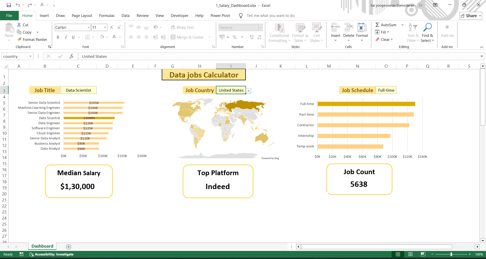

# 📊 Data Jobs Calculator — Excel Dashboard Project

This project is a hands-on replication of the Excel dashboard walkthrough by **Luke Barousse**, designed to explore data-related job roles, salaries, and job schedules across the United States. I followed his tutorial step-by-step and recreated the dashboard independently to reinforce my Excel skills and dashboard design thinking.

---

## 🎯 Project Overview

The **Data Jobs Calculator** dashboard includes:

- 📌 **Job Title & Median Salary**: Horizontal bar chart showing salaries for roles like Data Scientist, ML Engineer, Data Analyst, etc.
- 🌍 **Job Country Filter**: Interactive dropdown to filter jobs by country (default: United States).
- 🕒 **Job Schedule Filter**: Dropdown to explore salary distribution across Full-time, Part-time, Contractor, Internship, and Temp roles.
- 📈 **Job Schedule Breakdown**: Bar chart visualizing salary ranges by job type.
- 🗺️ **World Map**: Highlights countries where data jobs are available.
- 🏆 **Top Platform**: Displays the leading job platform (e.g., Indeed).
- 🔢 **Job Count**: Total number of jobs analyzed.

---

## 📁 Files Included

- `1_Salary_Dashboard.xlsx` — Fully functional Excel dashboard (protected for read-only viewing)
- `README.md` — This file

> 🔒 The Excel file is protected to preserve original formatting and formulas. Viewers can explore the dashboard but cannot modify its contents.

---

## 🧠 What I Learned

- Excel dashboard design principles
- Data visualization using charts and slicers
- Interactive filtering with dropdowns
- Replicating a professional-grade project from scratch

  

---

## 📚 Credits

- Tutorial by [Luke Barousse](https://www.youtube.com/@LukeBarousse)  
- Dataset sourced from [Dataset](https://github.com/lukebarousse/Excel_Data_Analytics_Course)

---

## 💬 Connect with Me

If you're exploring Excel for data analytics or want to collaborate on similar projects, feel free to reach out on [LinkedIn](https://www.linkedin.com/in/contactsaiyoogeswaran/).

---

> This project is part of my ongoing data journey. More dashboards and analytics projects coming soon!
